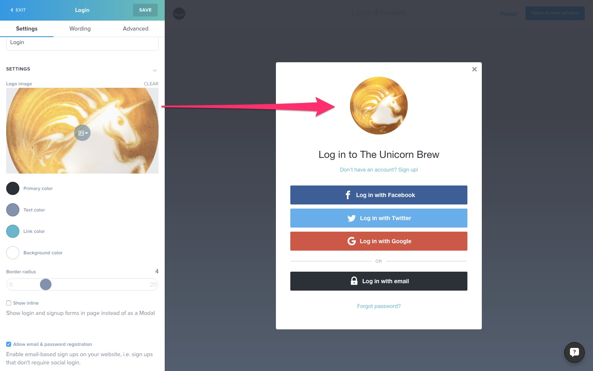
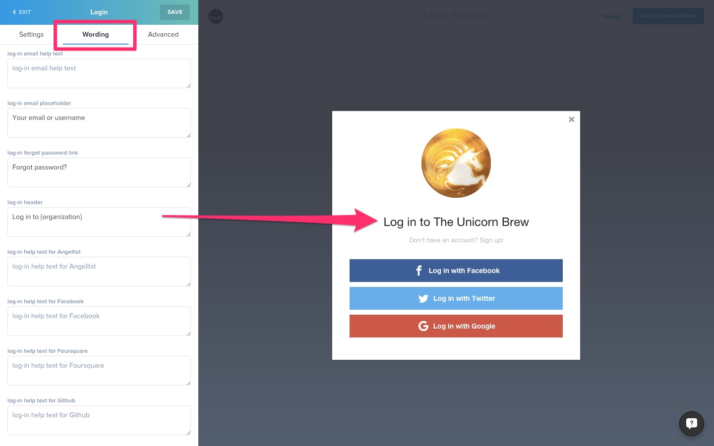
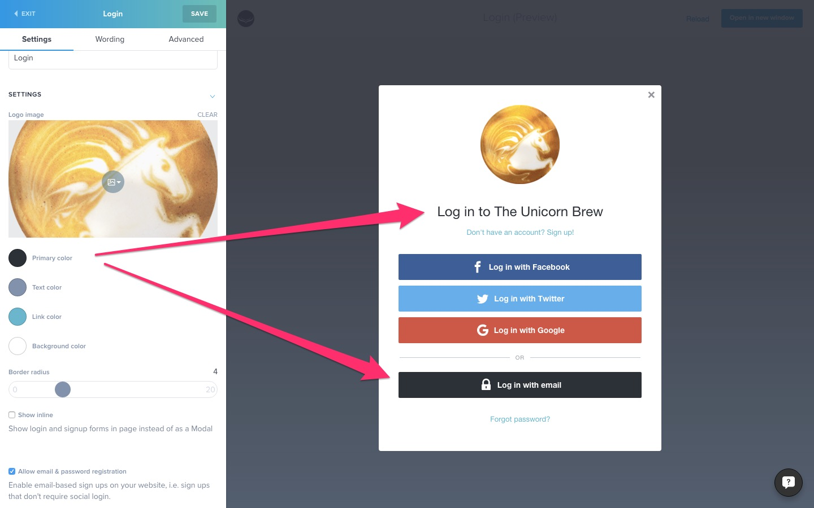
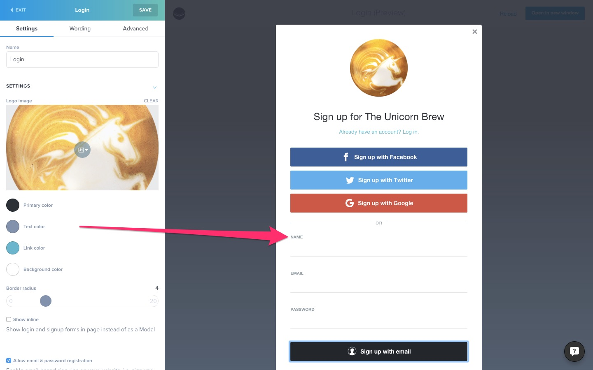
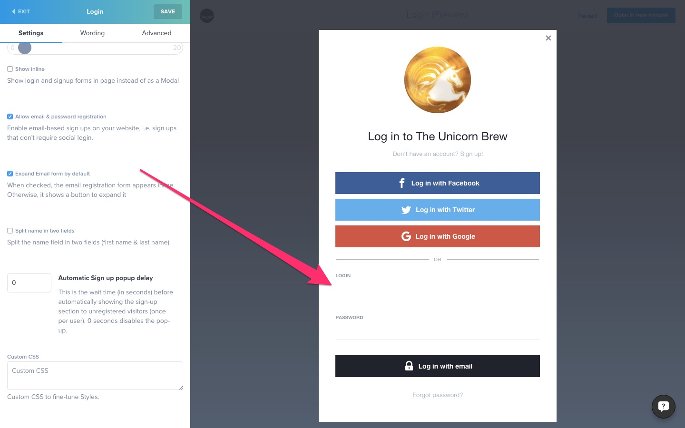
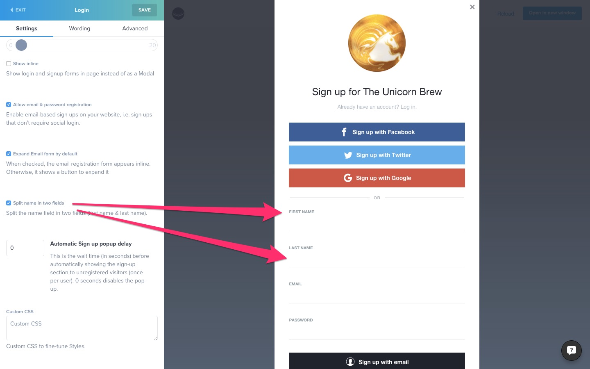
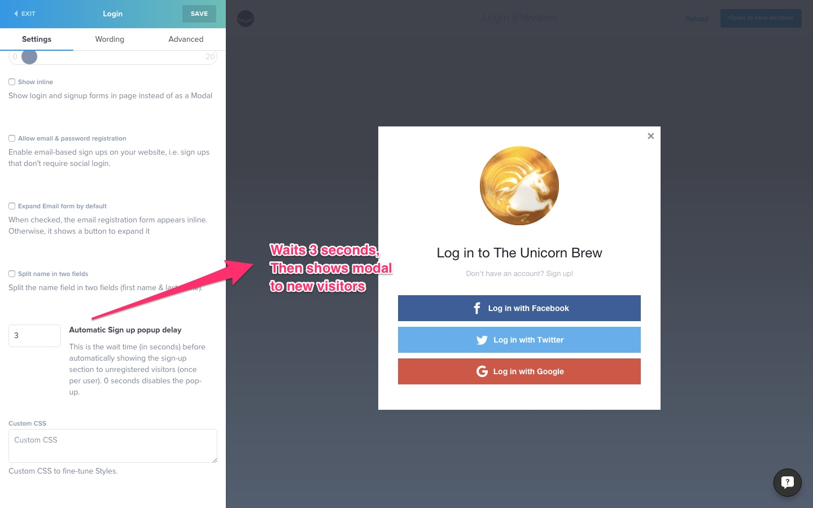
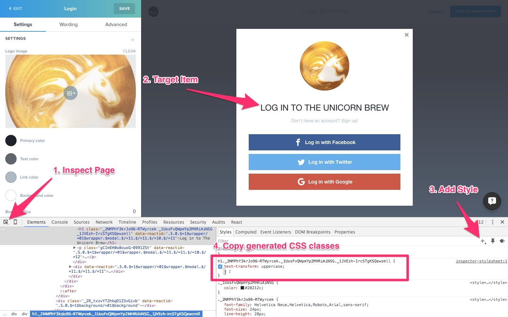

# Hull Login Modal Ship

__The Hull Login Modal Ship allows you to log customers in with a beautiful, in-page login overlay__

## Settings

The Login Modal ship is extremely configurable. It lets you customize a range of options to make it blend in your site in the best way possible.

##### Logo Image
Add your brand's Logo


##### Text Strings
Edit all UI text strings


##### Primary Color
Accent color, used for Buttons and main titles


##### Text Color
Color of basic text and form fields


##### Link Color
Color of the text links


##### Background Color
Modal Background color


##### Border Radius
Controls the Modal and Button border radius. Both are linked for best visual harmony.


##### Show Inline
Displays the entire form in directly the page, where the Ship is inserted instead of an Overlay.


##### Allow Email & Password Registration
Enable registration with an Email and Password combo. When disabled, users have to use Social Login to connect.


##### Expand Email form by default
Displays the input fields when opening the form. Otherwise, they're only shown when user clicks "Sign up with email"


##### Split name in two fields
Displays "First Name" and "Last Name" fields instead of a single "Name" field


##### Automatic Signup popup delay
Automatically displays the popup the first time a visitor comes on your site after the specified delay. By default equals 0, and never shows the popup automatically.


##### Custom CSS
Add custom CSS to the ship. We recommend you inspect the embedded ship with Chrome so you can target classes accurately


##### Changing Fonts
Changing the fonts for the Login Ship is easy. paste the following code in the Custom CSS box, using the right Font Family instead of `Helvetica`:
```css
._2mIIbscL4UJ7OCmjZHqSZu,
._33tK0-LYOsci0aZunQyZmT,
._2mIIbscL4UJ7OCmjZHqSZu *,
._33tK0-LYOsci0aZunQyZmT * {
  font-family: Helvetica;
}
```

## Events

The dialog can be controlled by triggering events. with the `Hull.emit` function.

- **`Hull.emit('hull.login.showDialog', options);`**: Opens the dialog.
- **`Hull.emit('hull.login.hideDialog', options);`**: Hides the dialog.
- **`Hull.emit('hull.login.activateLogInSection', options);`**: Opens the dialog if it is not opened and navigates to the log in section.
- **`Hull.emit('hull.login.activateSignUpSection', options);`**: Opens the dialog if it is not opened and navigates to the sign up section.
- **`Hull.emit('hull.login.activateResetPasswordSection', options);`**: Opens the dialog if it is not opened and navigates to the reset password section.
- **`Hull.emit('hull.login.activateShowProfileSection', options);`**: Opens the dialog if it is not opened and navigates to the profile section.
- **`Hull.emit('hull.login.activateEditProfileSection', options);`**: Opens the dialog if it is not opened and navigates to the edit profile section.

`options` is an optional Object passed to the next call to Hull.login() or Hull.signup(). It will persist as long as the modal is open, and disappear when it's dismissed. This way customers can switch between different tabs and sections without losing context.

It is useful to specify redirect strategies with `options.strategy`, or redirect URLs with `options.redirect_url` [Checkout the Hull.js Documentation](http://www.hull.io/docs/references/hull_js/#user-signup-and-login) for all supported options.

You can also prepopulate the user's email via `options.email`;
